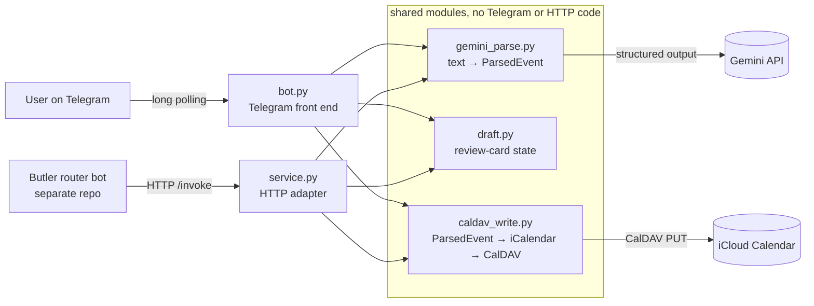
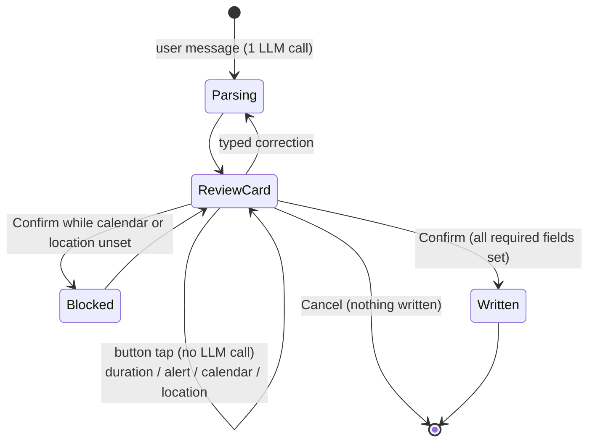

# Telegram → iCloud Calendar Bot

Type an event in plain English to a Telegram bot ("lunch with John next Friday 1pm at Toast Box"). An LLM (Google Gemini) turns it into structured fields, the bot shows a review card, and only after you confirm does it write the event, with an alarm, to an iCloud calendar over CalDAV.

**Personal project.** Built for my own household (two users) and run on my home NAS in Docker since August 2026. It is not a product and has no SLA.

---

## Architecture

The same Docker image runs as two processes. They share the modules on the right and nothing else:



| File | Job |
|---|---|
| `bot.py` | Telegram conversation: allowlist, review card, inline buttons, typed corrections |
| `service.py` | HTTP adapter (`/health`, `/capabilities`, `/invoke`) so the [Butler router](https://github.com/NasrumSeron/butler-llm-router) can drive the same flow. 9 actions, 1 public, 8 internal follow-ups |
| `draft.py` | The unconfirmed event and everything derived from it (duration, alarm, what's missing). No Telegram code, so it's unit-testable |
| `gemini_parse.py` | The only file that calls the LLM |
| `caldav_write.py` | Builds iCalendar text (a pure function) and writes it to iCloud |

## How the LLM is used

**One job only: parse free text into a fixed schema.** The LLM never writes to the calendar and never talks to the user directly; its output is rendered into a template the user reviews.

- **Model:** `gemini-3.5-flash-lite` on the Gemini free tier, via `google-genai`'s `generate_content()`.
- **Structured output:** `response_mime_type="application/json"` plus `response_schema=ParsedEvent` (a Pydantic model: `title`, `start_datetime`, `end_datetime`, `location`, `all_day`, `notes`). The reply is validated with `ParsedEvent.model_validate_json()`.
- **Prompting:**
  - The prompt injects the reference "now" (Asia/Singapore) so relative dates resolve deterministically.
  - It spells out house rules the model got wrong without them. Example: "next Friday" means Friday of the *following* calendar week, and "in 2 weeks on Tuesday" is anchored to this week's Monday.
  - The model is told to put anything it assumed (e.g. "no duration stated") in `notes` rather than guess silently. The review card shows that note.
- **Corrections:** a typed message while a draft is open ("make it 2pm") is sent with the pending event as JSON. The model decides whether it is an amendment (carry every other field over) or an unrelated new event.
- **Reliability:**
  - `google-genai` does not retry by default, so retries are configured explicitly: 4 attempts with exponential backoff, on HTTP 500/502/503 only.
  - If the primary model is still unavailable, the bot falls back once to `gemini-3.5-flash`.
  - The request timeout is 150 s, because free-tier latency can run to minutes.

### Confirmation flow



- Nothing is written before an explicit confirm.
- **Confirm is refused while the calendar or the location is unset.** Duration and alert always have defaults (60 min; 30 min before, or 09:00 for all-day events) and never block.
- Button taps change local state only, so after the first message the card responds instantly and costs no API calls.
- Typed corrections re-parse the event but keep the button choices already made.

## How it's tested

| Suite | Type | Checks | Needs |
|---|---|---|---|
| `tests/test_ical_offline.py` | iCalendar output: alarms, all-day dates, UTC times | 19 | nothing |
| `tests/test_flow_offline.py` | Whole Telegram conversation with Telegram, Gemini and iCloud mocked. Confirm blocking, button effects, corrections keep choices, exactly one write, allowlist (fails closed when empty) | 62 | nothing |
| `tests/test_service_offline.py` | HTTP adapter: draft → amend → confirm, expiry, draft ownership per user, error paths, input limits | 95 | nothing |
| `tests/live/test_gemini_parsing.py` | 10-phrase gold standard against the real model. Expected dates are computed from today's date | 10 phrases | Gemini key |
| `tests/live/test_alarms.py`, `test_caldav_write.py` | Real writes to iCloud, checked by eye on an iPhone | manual | iCloud |
| `tests/live/test_network.py`, `test_minimal_gemini.py` | Diagnostics for network/API hangs | — | network |

The offline suites (**176 checks**) run with no keys and no network:

```bash
pip install -r requirements.txt
python run_tests.py
```

Live tests are skipped unless you opt in: `RUN_LIVE_TESTS=1 python tests/live/test_gemini_parsing.py` (needs a filled-in `.env`).

**Recorded results**

- Gold standard (29 Sep 2026, `gemini-3.5-flash-lite`): **10/10 dates correct**. The script auto-checks only the date; time, title and location are checked by eye. First recorded 10/10 on 29 Aug 2026.
- Alarms: both the timed alarm and the all-day alarm fired on an iPhone (manual check, 7 Sep 2026).

## Run it (Docker)

```bash
cp .env.example .env        # fill in: Telegram token, Gemini key, Apple ID + app-specific password, allowed user IDs (required: the bot won't start without it)
docker network create --opt com.docker.network.driver.mtu=1460 bots-shared   # once
docker compose up -d --build
docker compose logs -f calendar-bot
```

- The MTU of 1460 fixed large HTTPS requests hanging silently on my network. Drop the option if your network is fine at 1500.
- To run only the Telegram bot: `docker compose up -d --build calendar-bot`.
- Without Docker: `pip install -r requirements.txt && python bot.py`.
- The iCloud password must be an [app-specific password](https://support.apple.com/en-us/102654), not your Apple ID password.

## Known limitations

- **One event per message.** Multi-event messages were deferred.
- **Drafts live in memory.** A restart loses any unconfirmed draft. Confirmed events are unaffected.
- **Timezone is hard-coded** to Asia/Singapore in the prompt and date handling.
- **Allowlist fails closed.** If `TELEGRAM_ALLOWED_USER_ID` is blank, the bot refuses to start and exits with a one-line message. Set your numeric Telegram user ID in `.env` **before the first start** (comma-separate more people).
- **The HTTP adapter has no authentication.** It trusts the `user_id` it is sent and relies on being reachable only on a private Docker network (no published ports). Don't expose port 8080.
- **One iCloud account.** All allowed users write through the same Apple ID, choosing between that account's calendars.
- **LLM output is checked for shape, not truth.** The schema guarantees valid fields, not the right date. The review card is the safeguard.
- **Free-tier latency.** The first reply can take from seconds to 1–2 minutes when Gemini is congested.
- The container runs as root. `service.py` uses the glibc-only `%-I` time format, so it runs on Linux/Docker, not native Windows.

## How it was built

I specified what the bot should do and made the design decisions described here: the confirmation rules, the routing thresholds, and what counts as a correct result. I also deployed and operated it on my own hardware and found the bugs mentioned in the code comments through daily use. Most of the code was written by Claude (Anthropic) from my specs, in an AI-assisted workflow.

## Licence

MIT — see [LICENSE](LICENSE).
